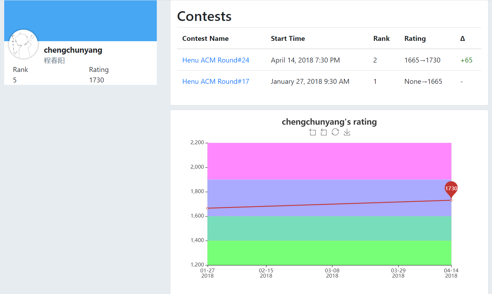
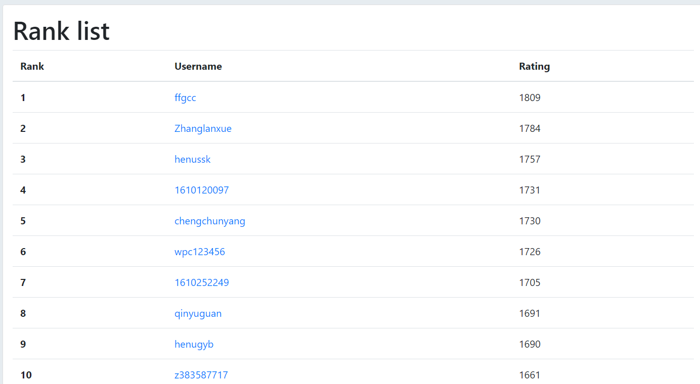

# vj_rating

[中文README](/README_zh.md)

A python application for calculating [vjudge](https://vjudge.net) contest rating.

Includes:

- A rating calculator library based on Codeforces rating system.
- A web interface for showing rating result.

## Usage

WIP
