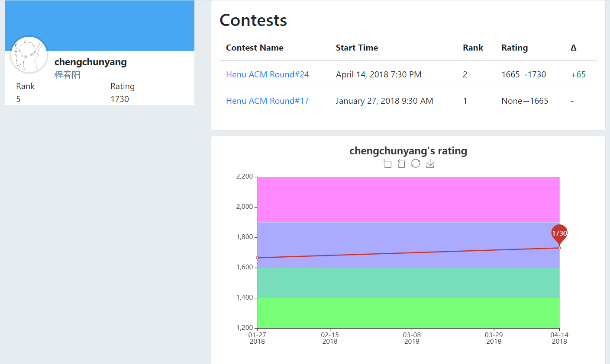
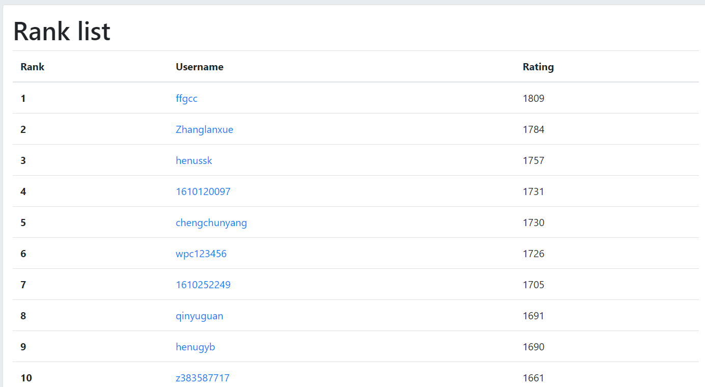

# vj_rating

一个用于从 [vjudge](https://vjudge.net) 的比赛中自定义计算分数的 python 应用，包括了：

- 一个基于 Codeforces 分数系统的比赛分数计算库。
- 一个展示分数的网站。




## 快速开始

在开始之前，你需要安装 python 3 （推荐3.6+），并安装好环境管理库 `pipenv`。

```sh
pip install pipenv
```

下载源码（clone 或者[直接下载](https://github.com/rosekc/vj_rating/archive/dev.zip)后解压）以后，在**项目根目录**下用命令行输入以下命令，安装环境依赖。

```sh
pipenv install
```

进入虚拟环境。

```sh
pipenv shell
```

初始化目录。

```sh
flaks init
```

默认情况下将会在在项目根目录下生成 `instance` 目录。

接下来试试添加比赛记录。

打开任意比赛的**榜单页面**，`f12` 进入开发者环境，复制整个 html。


拷贝到 `instance/rank` 目录下，以 `数字.html` 命名，如 `1.html`，这个数字决定了比赛加载顺序（小的先加载）。

接着计算结果。

```sh
flaks cal
```

打开开发环境服务器。

```sh
flaks run
```

默认情况下前往 [http://localhost:5000](http://localhost:5000) 即可看到结果。

## 部署

推荐的部署方式是静态部署。

```sh
flaks freeze
```

该命令将在 `instance/bulid` 目录下生成静态文件，这些文件可以直接部署到静态页面服务（如 github page ），也可以自行搭建服务。

可以在 `instance/bulid` 目录下运行 `python -m http.server` ，开启一个 http 服务器，测试生成文件。默认情况下输入 [http://127.0.0.1:8000](http://127.0.0.1:8000) 即可看到生成的页面。
